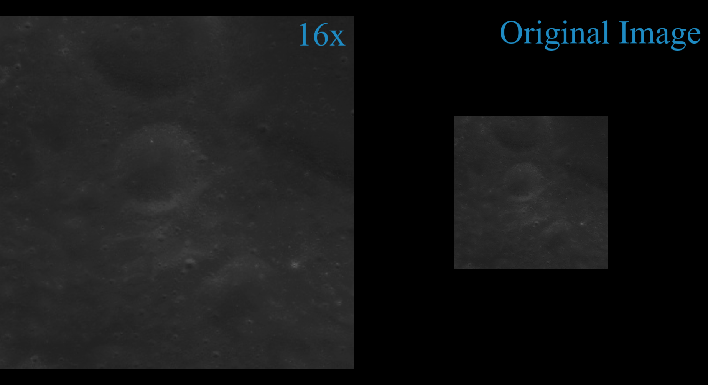
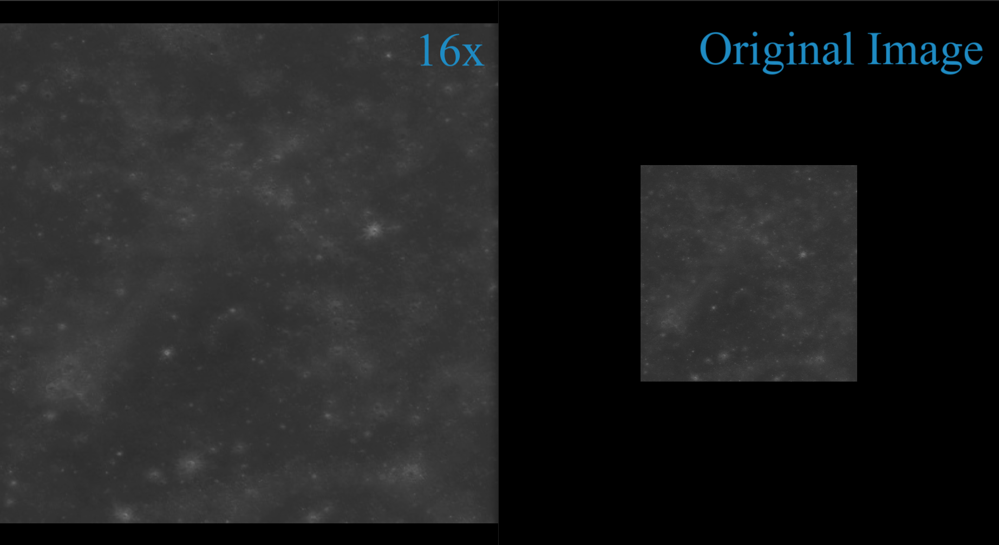

# Team 13 - ISRO Moon Mapping Challenge, Inter IIT Tech Meet 11.0 (Team ID - 13, Secondary ID - 26)

## Update: We won a Bronze Medal! Special Thanks to Manoj hard carrying us!



## Table of Contents

[Part 1: TMC Super Resolution](#tmc-super-res)
- [Pretrained Weights](#pretrained-weights)
- [Train](#train)
- [Validation](#validation)
- [Test/Inference](#testinference)
- [Loss Functions](#lossfunctions)
- [References](#references)

[Part 2: Global Lunar Atlas]


## Pretrained Weights:

Pretrained Weights for Super-Resolution model (SRUN): [SRUN Weights](https://drive.google.com/file/d/1jDtWT_fbT9O2xmU-Mb5ycEl6ARF0Q5FZ/view?usp=share_link "srun")

Pretrained Weights for SORTN model (required to run the code): [SORTN Weights](https://drive.google.com/file/d/15ImRmGoORsCLSIy4tMJxtbH9NXLXGvVV/view?usp=share_link "sortn") 

## Train
**Command**:
```bash
gdown --no-cookies 1oa8qAHleja_HelWXiq24Ombf0UkFSMcB

pip3 install -r requirements.txt

./run_script.sh train
```
Train Dataset - [train](https://drive.google.com/file/d/1oa8qAHleja_HelWXiq24Ombf0UkFSMcB/view?usp=share_link)

Downloads the dataset required to perform the training. The data is curated from [browse_derived.zip](https://pradan.issdc.gov.in/ch2/protected/downloadFile/tmc2/browse_derived.zip) from Pradan, ISRO. The method uses both DTM and ortho-derived TMC images for training.

Installs the required libraries from requirements.txt and runs the train script.

Before running the code, respective directories for the dataset and the directories where the results are to be stored must be given in the config.yaml file. New folders will be created for result directories already if they are not present.

## Validation

| Resolution | PSNR | SSIM | 
| --- | :---: | :---: |
| 4x | 28.26 | 0.790 |
| 16x | 22.21 | 0.702 |

Validation Dataset - [val](https://drive.google.com/file/d/1vWCmwifFBENYm5LrrjJen9aJM4-fcJO4/view?usp=share_link)

**Command**:
```bash
gdown --no-cookies 1vWCmwifFBENYm5LrrjJen9aJM4-fcJO4

pip3 install -r requirements.txt

./run_script.sh validate
```

Downloads the dataset required to perform validation. The data is curated from [browse_calibrated_2022.zip](https://pradan.issdc.gov.in/ch2/protected/downloadFile/tmc2/browse_calibrated_2022.zip) from Pradan, ISRO.

Before running the code, the directory to the input validation dataset must be given. Please make sure that the TMC images given are in jpeg format.

## Test/Inference

**Command**:

```
pip3 install -r requirements.txt

./run_script.sh inference
```

Before running the code, the directory to input TMC images must be given (Inference Images by default). Any number of TMC images can be put in the folder and the model would be able to generate super-resolved SAR images for each of them. Note that the TMC images must be in jpeg format.

## Super_Resolution_Demo jupyter notebook
This notebook contains the same commands required for validation and inference.

## Solution Development
* The model is trained on around 18000 TMC-ortho pairs of patches. Patch size is 400x400.
* Model: SORTN (Present in next branch) is the generator using to obtain the ortho-derived image from TMC.
* SRUN: Responsible for super-resolving the TMC image, the architecture is similar to U-Net along with spatial attention modules. 
* For inference, preprocessing involving clipping, despeckling, adaptive histogram scaling, minmax scaling between -1 to 1 and cropping to required patches is done. The patches are super-resolved and later stitched together. The steps can be visualized in the Test_Sentinel jupyter notebook.
* The loss functions we used are as described below. 

## Loss Functions:
- **SRUN Loss**: 

$$\mathcal{L}_{SRUN} = \mathcal{L}_{content} + \{0.1} \mathcal{L}_{evaluation}$$ 

- **SORTN Loss**:

$$\mathcal{L}_{SORTN} = \mathcal{L}_{cGAN} + \{100} \mathcal{L}_{1}$$ 

(the second term represents the L1-loss between optical ground truth and optical generated images)

# Task 2
Using the OGSRN model, we are able to make 400x400 patches into 6400x6400 patches without loss of resolution. Using this we have written a script that will take the image, split it up into 400x400 tiles, and super resolve them.

However, we were unable to completely get a TMC mapping of the lunar surface. The data was not overlapping, and despite downloading more than 300gb of TMC data, the images were staggered with considerable gaps between them, which is understandable considering the gap in time between successive exposures. We have attached a portion of the raster file for your reference.

We have taken patches from NASA's LRO orbiter that was available in public-domain, and have super resolved them, and attached it for your perusal.

Drive Link: [link](https://drive.google.com/drive/folders/1nQu0MQKTxLMYdhEf1dvx1tSTZPjtJN4W?usp=sharing)


## References:

OGSRN: Optical-guided super-resolution network for SAR image (2022) - [link](https://www.sciencedirect.com/science/article/pii/S1000936121003459)

